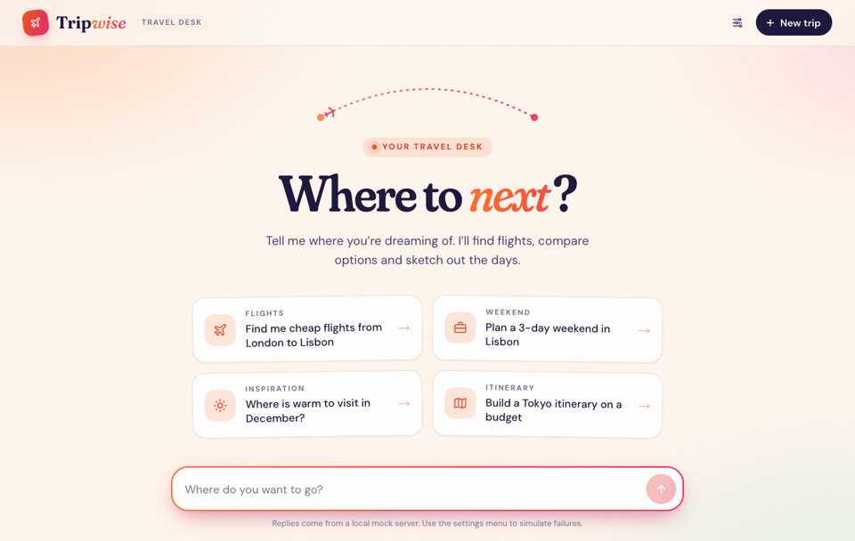
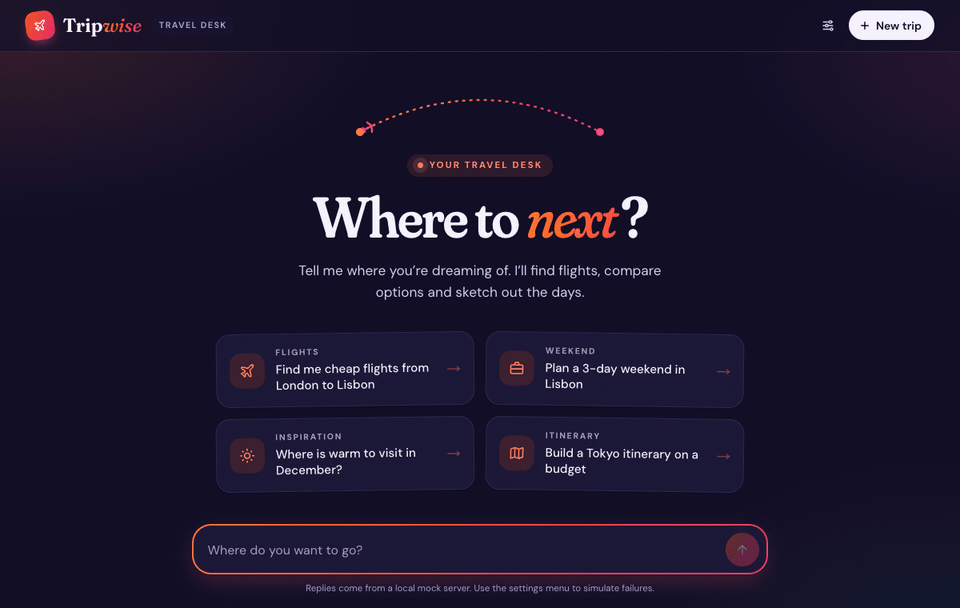
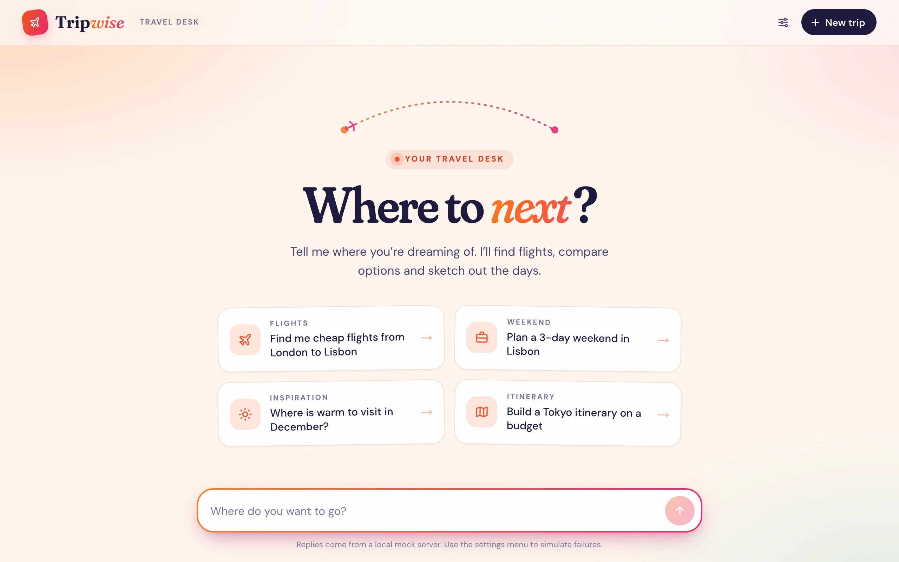
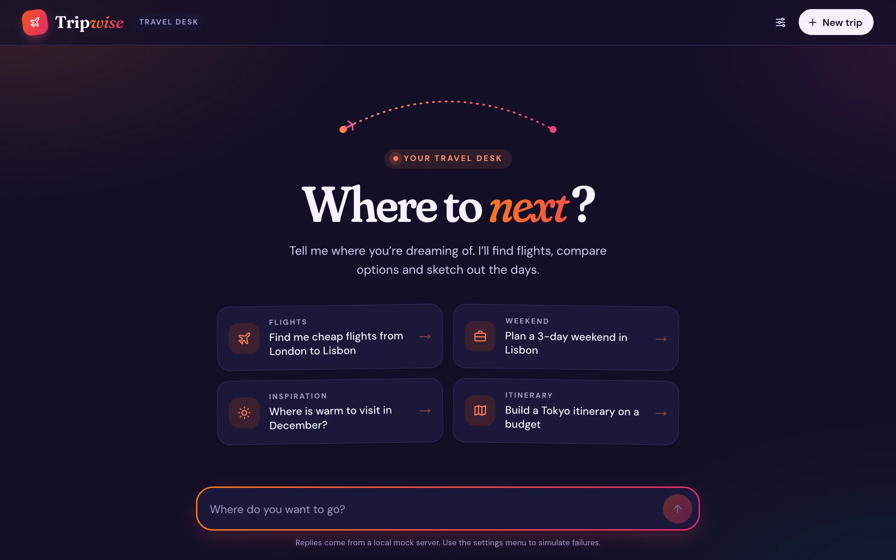
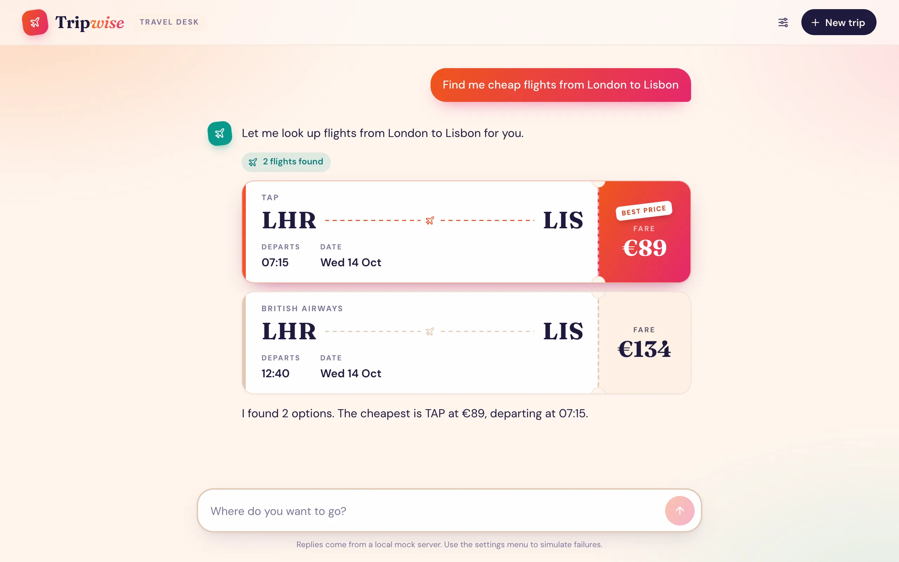
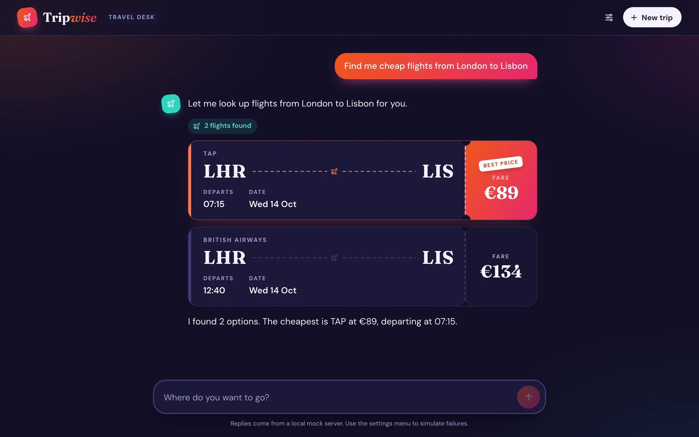
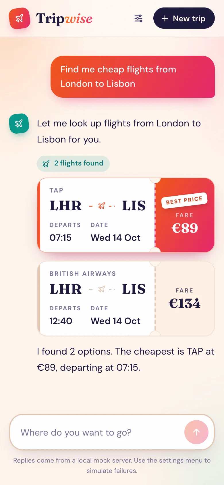
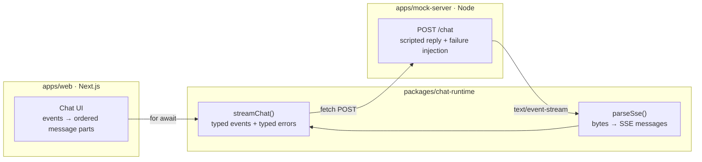

<div align="center">

# Trip*wise*

**A streaming AI trip-planning assistant.** Replies appear word by word, tool calls turn into
live boarding passes, and every way the network can fail is handled gracefully.

[](https://github.com/smritisharma30/tripwise/actions/workflows/ci.yml)




</div>

## Why this project

A streaming chat UI looks simple, but it hides real engineering problems. Network chunks don't line
up with messages, tool calls arrive halfway through a sentence, connections drop, and users hit
_Stop_. Tripwise is a small, production-minded take on all of these, built from the byte stream
up with no chat SDK.

## Highlights

- **A Server-Sent Events parser written from scratch.** It follows the
  [WHATWG spec](https://html.spec.whatwg.org/multipage/server-sent-events.html) and handles events
  split across network chunks, `\r\n` split across two reads, multi-byte characters like `€`,
  comments, and multi-line data. Every one of those cases has a test.
  → [`sse-parser.ts`](packages/chat-runtime/src/sse-parser.ts)
- **Streaming with `fetch` and `ReadableStream`**, because `EventSource` can't send a POST body.
  An async-generator pipeline turns bytes into SSE messages, then into typed chat events, then
  into React state.
- **Tool calls rendered in the order they stream.** Text, then a live flight search, then more
  text. Results appear as boarding passes, with the cheapest fare stamped **Best price**.
- **Built to fail well.** The mock backend can drop the connection, send a malformed event, send
  an error, or start slowly. The UI tells apart a lost connection, a server error, an unfinished
  stream and a user stop, and **Retry** re-runs the reply in place.
- **Cancellation from end to end.** _Stop_ aborts `fetch`, which closes the parser, which makes
  the server stop its timers. Nothing keeps running in the background.
- **Accessible and responsive.** Screen-reader live region, reduced-motion support, IME-safe
  Enter-to-send, light and dark themes, works on mobile.
- **Strict by default.** TypeScript with `noUncheckedIndexedAccess` and
  `exactOptionalPropertyTypes`, type-aware ESLint, 32 tests, and CI on every push.

## Handling failure



The mock server injects failures through query parameters, so every failure mode can be
reproduced on demand, both in tests and from the in-app settings menu:

| Mode               | What happens on the wire                               | What the user sees                                               |
| ------------------ | ------------------------------------------------------ | ---------------------------------------------------------------- |
| `?fail=drop`       | The socket closes mid-reply with no final event        | _The connection was lost mid-reply._ with **Retry**              |
| `?fail=malformed`  | One event arrives with data that isn't valid JSON      | Nothing breaks: the bad event is skipped and the reply continues |
| `?fail=error`      | The server sends an `error` event, then closes cleanly | The server's message with **Retry**                              |
| `?startDelay=3000` | Headers arrive at once, the first token arrives late   | A typing indicator until text arrives                            |
| Stop button        | The client aborts the request                          | _Stopped_ with **Regenerate**                                    |

## Screenshots

| Light                                                                                          | Dark                                                                                         |
| ---------------------------------------------------------------------------------------------- | -------------------------------------------------------------------------------------------- |
|                   |                   |
|  |  |

<details>
<summary><strong>Mobile</strong></summary>
<br />

</details>

## Architecture



Each layer turns its input one step closer to what the screen needs:

| Layer                                                    | Input → output          | Responsibility                                                                              |
| -------------------------------------------------------- | ----------------------- | ------------------------------------------------------------------------------------------- |
| [`parseSse`](packages/chat-runtime/src/sse-parser.ts)    | bytes → SSE messages    | Buffering, line endings, UTF-8, following the spec                                          |
| [`streamChat`](packages/chat-runtime/src/stream-chat.ts) | messages → `ChatEvent`s | Typing, skipping malformed events, sorting failures into `http`, `network` and `incomplete` |
| [`chat.tsx`](apps/web/app/_chat/chat.tsx)                | events → React state    | Ordered text and tool parts, retry, stop, auto-scroll                                       |

The wire format is simple enough to read in `curl`:

```text
id: 12
event: tool_call
data: {"id":"call_1","name":"search_flights","args":{"from":"LHR","to":"LIS","date":"2026-10-14"}}

```

The full contract is in [`docs/sse-protocol.md`](docs/sse-protocol.md).

## Tech stack

| Area           | Choice                                                                                    |
| -------------- | ----------------------------------------------------------------------------------------- |
| UI             | Next.js 16 (App Router), React 19, CSS Modules with design tokens, `next/font`            |
| Streaming      | `fetch` + `ReadableStream` + `TextDecoderStream`, async generators, `AbortController`     |
| Backend (mock) | Plain `node:http`, so every SSE byte is visible                                           |
| Tooling        | pnpm workspaces + catalogs, Turborepo, TypeScript (strict), ESLint (type-aware), Prettier |
| Testing & CI   | Vitest (unit tests plus integration tests over a real socket), GitHub Actions             |

## Getting started

Requires **Node 22.12+** (see [`.nvmrc`](.nvmrc)).

```sh
nvm use
corepack enable      # provides the pinned pnpm version
pnpm install
pnpm dev             # web on http://localhost:3000, mock server on :4000
```

Try the raw stream and its failure modes:

```sh
curl -N -X POST 'http://localhost:4000/chat'
curl -N -X POST 'http://localhost:4000/chat?fail=drop&failAt=5'
curl -N -X POST 'http://localhost:4000/chat?fail=malformed&tokenDelay=200'
```

| Command             | What it does                            |
| ------------------- | --------------------------------------- |
| `pnpm dev`          | Run all apps in watch mode              |
| `pnpm build`        | Production build                        |
| `pnpm lint`         | ESLint (type-aware) across all packages |
| `pnpm typecheck`    | `tsc --noEmit` across all packages      |
| `pnpm test`         | Vitest across all packages              |
| `pnpm format:check` | Prettier check                          |

## Project structure

```text
apps/
  web/                 Next.js chat UI (app/_chat holds the chat components)
  mock-server/         SSE backend: scenario, framing, failure injection, tests
packages/
  chat-runtime/        SSE parser + streamChat client (no React, framework-agnostic)
docs/
  sse-protocol.md      Wire contract between server and client
  decisions/           Architecture decision records
```

## Roadmap

- [ ] Live demo: serve `/chat` from a Next.js route handler and deploy on Vercel
- [ ] Runtime validation of event payloads (schema per event type)
- [ ] Batch token updates per animation frame for very fast streams
- [ ] Markdown rendering in replies, and a "jump to latest" button
- [ ] End-to-end tests with Playwright for every failure mode
- [ ] Put a real LLM provider behind the same wire protocol

---

<div align="center">

Built by [Smriti Sharma](https://github.com/smritisharma30)

</div>
